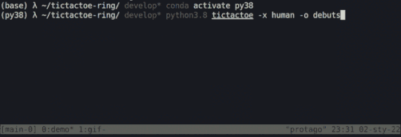

# TicTacToe Ring

##### i.e. my tictactoe tournament arena for crash testing ai-bot designs

  
 &nbsp;
 
The purpose of all-of-this, despite pure fun, is to easy the process of behind-the-curtain algorithms validation for *searchable* games. To achieve this the following assumptions have been realized:
 - referential agents implementations i.e.: `Minmax`, `Debuts`, `Random`, `Search` (and `Human`;p);
 - `playground` / `tournament` modes providing respectively touch'n'feel / at-scale gameplay(s);
 - transparent API exposed to interfere with: [BoardAPI](https://github.com/protago90/tictactoe-ring/blob/main/tictactoe/board.py#L8) and [PlayerAPI](https://github.com/protago90/tictactoe-ring/blob/main/tictactoe/player.py#L10);
 - twofold UI, via: shell cli script (see `demo.gif`) or clickable GUI (should be hosted TODO ).
