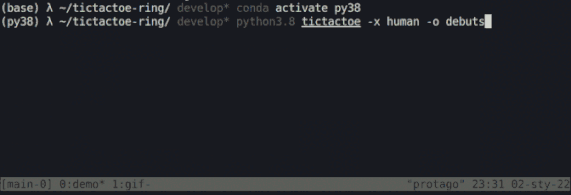

# TicTacToe Ring

##### i.e. my tictactoe tournament arena for crash testing ai-bot designs

<p align="center">  </p> &nbsp;

The purpose of what's above, despite fun, was to facilitate the the process of behind-the-curtain algorithms validation for searchable games —the following have been accomplished:
 - referential bots implementations i.e.: `minmax`, `debuts`, `random`, `search` (and `human`^^);
 - `playground` / `tournament` modes providing respectively touch'n'feel / at-scale gameplays;
 - transparent API exposed to interfere with: [BoardAPI](https://github.com/protago90/tictactoe-ring/blob/main/tictactoe/board.py#L8) and [PlayerAPI](https://github.com/protago90/tictactoe-ring/blob/main/tictactoe/player.py#L10);
 - twofold UI, via: shell cli script (see `demo.gif`) or clickable GUI (should be hosted [HERE](https://share.streamlit.io/protago90/tictactoe-ring) ).

##### #CLI QUICKTOUR

```
python3.8 -m tictactoe -o debuts -x minmax  # -n 10
```
##### #GUI QUICKTOUR
```
streamlit run streamlit.py
```