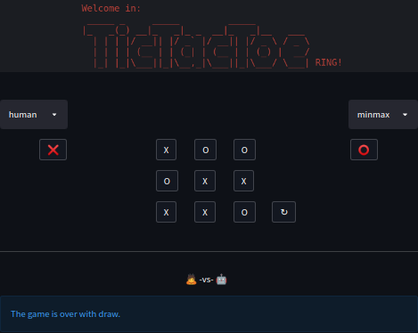

# TicTacToe Ring

##### i.e. my tictactoe tournament arena for crash testing ai-bot designs

  
 &nbsp;
 
The purpose of what's above, despite fun, was to facilitate the the process of behind-the-curtain algorithms validation for searchable games —the following have been accomplished:
 - referential bots implementations i.e.: `minmax`, `debuts`, `random`, `search` (and `human`^^);
 - `playground` / `tournament` modes providing respectively touch'n'feel / at scale gameplays;
 - transparent API exposed to interfere with: [BoardAPI](https://github.com/protago90/tictactoe-ring/blob/main/tictactoe/board.py#L8) and [PlayerAPI](https://github.com/protago90/tictactoe-ring/blob/main/tictactoe/player.py#L10);
 - twofold UI, via: shell cli script (see `demo.gif`) or clickable GUI (hosted? [HERE](https://share.streamlit.io/protago90/tictactoe-ring/main/streamlit.py) ).
 
##### QUICKTOUR

<table>
<tr>
<td>

    >> # for client shell scirpt:
    >> # (optiona) python3.8 -m pip install tqdm==4.51.0
    >> python3.8 -m tictactoe -o debuts -x minmax  # -n 10

    >> # for gui server deploy & run:
    >> python3.8 -m venv .env && source .env/bin/activate && python3.8 -m pip install -r requirements.txt
    >> streamlit run streamlit.py

    >> # for gui server deploy & run with docker:
    >> sudo docker build -t streamlit .
    >> docker run -p 8501:8501 treamlit
</td>
<td></td>
</tr>
</table>
